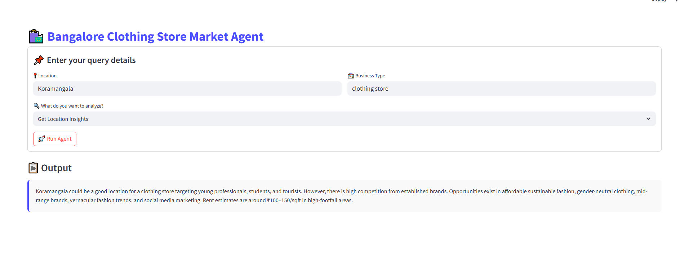

# 🛍️ Bangalore Clothing Store Market Agent

This Streamlit-based AI agent helps you analyze the **clothing store market** in various areas of **Bangalore** (or any other location). It provides business insights, competitor search, and market analysis using real-time data and LLMs.

---

## 🚀 Features

- 🔍 **Search Competitors** in a specific location
- 📊 **Generate Market Analysis** for a given business type
- 🧠 **Get Location Insights** to understand business density and trends
- 🧵 Uses an LLM-backed agent for natural query processing
- ✨ Enhanced UI with clean layout, icons, and responsive elements

---

## 🖥️ UI Screenshots

| 📥 Input Form | 📋 Output Display |
|--------------|------------------|
|  |  | 
 | |

---

## 📦 Setup Instructions

### 1. Clone the Repository

```bash
git clone https://github.com/yourusername/clothing-store-agent.git
cd clothing-store-agent
2. Create a Virtual Environment
bash
Copy
Edit
python -m venv venv
source venv/bin/activate  # On Windows: venv\Scripts\activate
3. Install Dependencies
bash
Copy
Edit
pip install -r requirements.txt
4. Add Your API Keys (Optional)
If your agent requires access to external data like Google Places or SerpAPI, create a .env file:

env
Copy
Edit
SERPAPI_API_KEY=your_serp_api_key
GOOGLE_PLACES_API_KEY=your_google_places_key
5. Run the App
bash
Copy
Edit
streamlit run app.py
🧠 How It Works
The app uses a build_agent() function that wraps a LangGraph or Gemini-powered agent. This agent interprets business questions and executes structured prompts to extract relevant insights.

