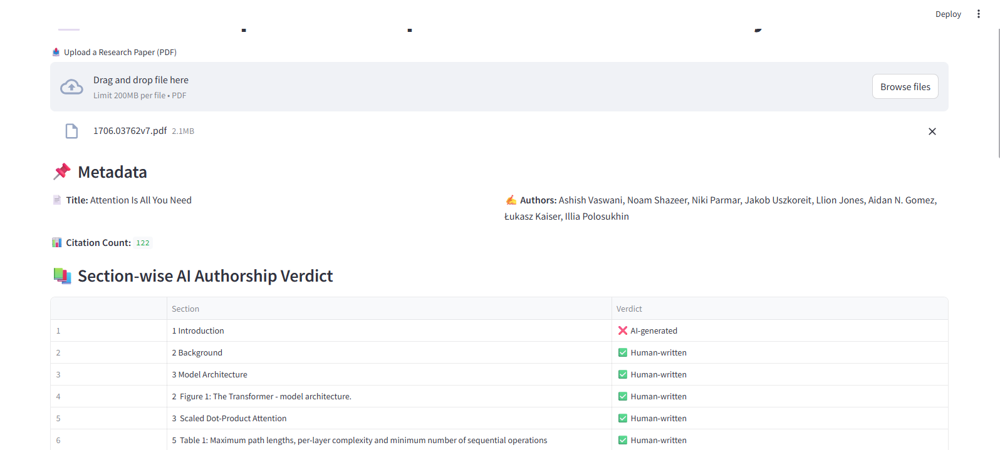
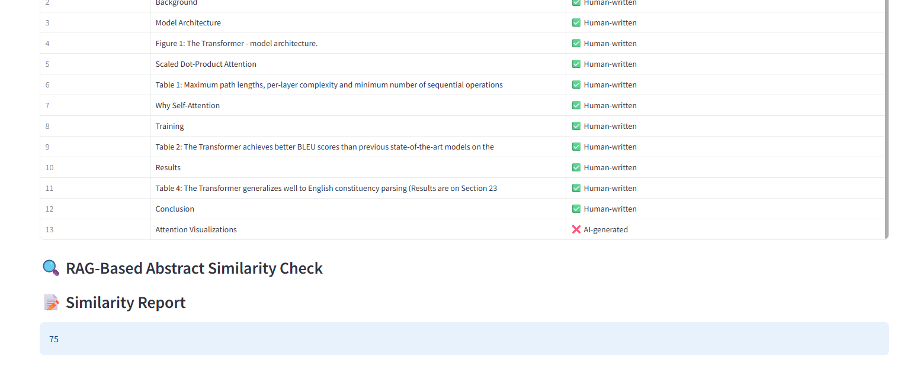

# 📄 Research Paper Authorship Checker with RAG Similarity

A **Streamlit-based web app** to verify the **authenticity of research papers** using **Large Language Models (LLMs)** and **RAG (Retrieval-Augmented Generation)** techniques.

This tool helps you determine if sections of a research paper are **AI-generated** and checks the **originality** of the abstract by comparing it with similar published works.

---

## 🚀 Features

### ✅ Metadata Extraction  
Automatically extracts:
- Title  
- Authors  
- Abstract  
from uploaded PDF files using **PyMuPDF**.

### 📊 Citation Count Fetching  
Retrieves the citation count of the paper from [OpenAlex](https://openalex.org/).

### 🧠 Section-wise AI Detection  
Uses **Gemini Pro** to classify each section of the paper as:
- ✅ Human-written  
- ❌ AI-generated

### 🔍 Abstract Similarity Check (RAG)  
Fetches similar papers using OpenAlex and evaluates how closely the uploaded paper's abstract resembles them, returning a **similarity score (0–100)**.

---

## 🧰 Technologies Used

- **[Streamlit](https://streamlit.io/)** – Interactive UI  
- **[PyMuPDF](https://pymupdf.readthedocs.io/en/latest/)** – PDF parsing and text extraction  
- **[Google Gemini API](https://ai.google.dev/)** – LLM for classification and similarity scoring  
- **[OpenAlex API](https://docs.openalex.org/)** – Academic research database  
- **Pandas** – Display tabular verdicts on section analysis  

---

## 📦 Installation & Setup

### 1️⃣ Install Dependencies

```bash
pip install streamlit pymupdf google-generativeai pandas requests
2️⃣ Set Up API Keys
You can either store the keys securely using .env or define them directly in your code:

python
Copy
Edit
GEMINI_API_KEY1 = "your-gemini-api-key-1"  # For section-wise classification  
GEMINI_API_KEY2 = "your-gemini-api-key-2"  # For abstract similarity scoring
▶️ Running the App
bash
Copy
Edit
streamlit run app.py
Replace app.py with your script filename if different.

🧪 How It Works
Upload a research paper (PDF).

Extracts metadata: Title, Authors, Abstract.

Fetches citation count via OpenAlex.

Splits the content into logical sections.

Uses Gemini to analyze each section for AI authorship.

Performs abstract similarity comparison using RAG (Gemini + OpenAlex).

Displays a final similarity percentage and section-wise verdicts.

📸 Demo Screenshot



Example of section classification and similarity check

