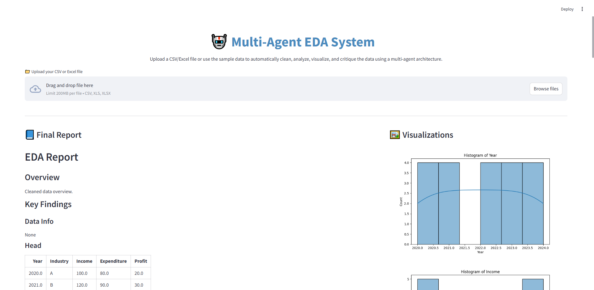

# Streamlining EDA with a Multi-Agent System using Autogen

This project demonstrates a modular, multi-agent approach to Exploratory Data Analysis (EDA) using [Autogen](https://github.com/microsoft/autogen), Streamlit, and Google Gemini LLM. Each agent specializes in a key EDA task, and the system produces a comprehensive, high-quality EDA report with visualizations and critique.

## Key Agents
- **Data Preparation Agent**: Cleans and preprocesses data.
- **EDA Agent**: Summarizes statistics and generates insights/visualizations.
- **Report Generator Agent**: Creates a structured EDA report.
- **Critic Agent**: Reviews and suggests improvements using Gemini LLM.
- **Executor Agent**: Validates the report.
- **Admin Agent**: Coordinates the workflow.

## Features
- Automated EDA pipeline with modular agents
- Streamlit web UI for file upload and report viewing
- Google Gemini LLM for feedback (API key in code)
- Generates a sample dataset if none is uploaded

## Usage
1. Install requirements: `pip install -r requirements.txt`
2. Run the app: `streamlit run app.py`
3. Upload a CSV/Excel file or use the generated sample data

## Output
- Cleaned data summary
- Key findings and insights
- Multiple visualizations
- Critic feedback and validation

## Example Screenshots

Below are example outputs from the Streamlit app:

### 1. App Home and File Upload

### 2. Final Report and Visualizations (Part 1)

### 3. Final Report and Visualizations (Part 2)

### 4. Critic Feedback Section

--- 