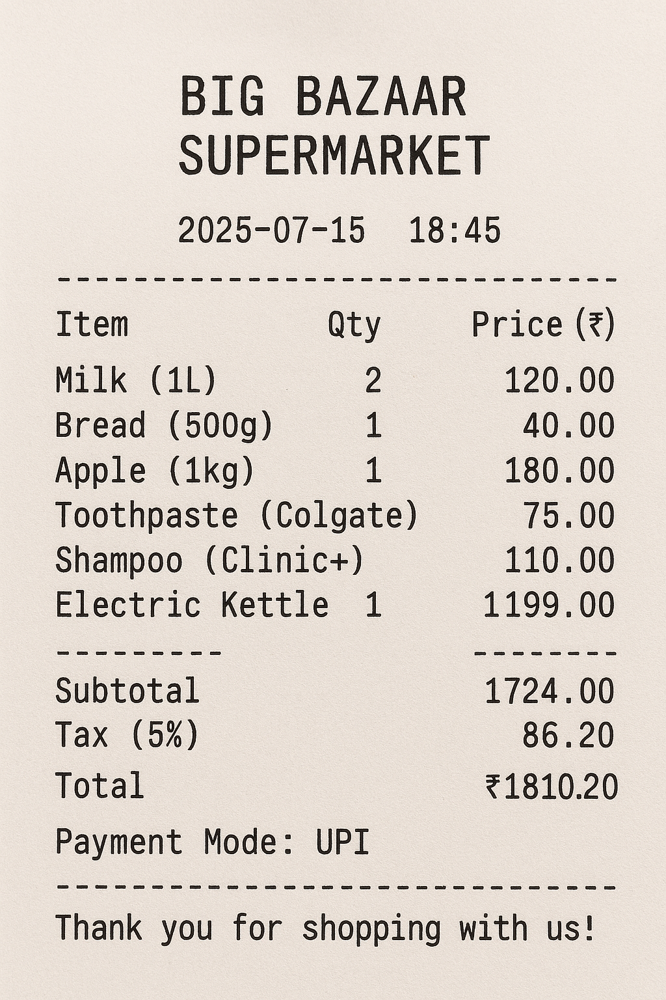

# Bill Managing Agent

A Streamlit-based agentic system that helps users efficiently track their expenses by processing bill images, categorizing expenses into common groups, calculating total expenditure, and providing insights into spending patterns using Google Gemini LLM and collaborative agent workflow.

## Features
- **Agent Collaboration:** Multiple specialized agents (User Proxy, Group Manager, Bill Processing, Expense Summarization) collaborate via a group chat workflow.
- **Image Processing:** Upload and process bill images (jpg, png, pdf) for expense extraction.
- **Smart Categorization:** Automatically categorizes expenses into common groups (groceries, dining, utilities, shopping, entertainment).
- **Visual Analytics:** Interactive bar charts showing spending by category with highlighted highest expenditure.
- **Spending Insights:** Detailed analysis of spending trends and unusual patterns.
- **Google Gemini LLM:** All analysis and categorization powered by Gemini (API key set directly in code).

## Folder Structure
```
bill managing agent/
├── agents.py                # All agent workflow logic
├── app.py                   # Streamlit UI with visualizations
├── gemini_api.py            # Gemini API utility
├── requirements.txt         # Dependencies
├── screenshots/             # App screenshots and sample bill
│   ├── Screenshot 2025-07-28 014417.png
│   ├── Screenshot 2025-07-28 014438.png
│   └── billSample.png
└── README.md               # This file
```

## Setup & Installation
1. **Clone the repository** and navigate to the project folder.
2. **Install dependencies:**
   ```sh
   pip install -r requirements.txt
   ```
3. **API Key:**
   - The Google Gemini API key is set directly in `gemini_api.py` (no .env file needed).
   - If you wish to use your own key, edit the `API_KEY` variable in `gemini_api.py`.

## Running the App
```sh
streamlit run app.py
```
- Open the provided local URL in your browser.
- Upload a bill image (jpg, png, or pdf).
- Click **Process Bill** to generate your expense analysis.

## Agent Workflow
1. **User Proxy Agent:** Initiates the workflow and receives the bill image.
2. **Group Manager Agent:** Orchestrates the conversation and directs the workflow.
3. **Bill Processing Agent:** Extracts data from the uploaded bill image and categorizes expenses into common groups.
4. **Expense Summarization Agent:** Analyzes the categorized expenses, provides spending breakdown, and identifies trends.

## Screenshots
| Sample test case | Bill Processing | Results & Visualization |
|-----------|----------------|------------------------|
|  |  |  |

## Sample Input & Output
**Input:** Bill image containing expenses like:
- Groceries: Milk ($3.50), Bread ($2.75), Eggs ($4.20), Apples ($5.00)
- Dining: Lunch at Cafe ($25.00)
- Shopping: T-shirt ($15.99)

**Output:**
- **Category Totals:**
  - Groceries: $15.45
  - Dining: $25.00
  - Shopping: $15.99
- **Highest Spending Category:** Dining ($25.00)
- **Spending Trends:** Analysis of unusual patterns and recommendations
- **Visual Chart:** Bar chart showing spending distribution by category

## Key Features
- **No .env Required:** API key is set directly in code for simplicity.
- **Modular Architecture:** Agent logic separated from UI for maintainability.
- **Error Handling:** Graceful handling of image processing and API errors.
- **Real-time Processing:** Immediate analysis and visualization of uploaded bills.
- **Conversation Log:** Transparent view of agent interactions and reasoning.

## Notes
- The app can process various bill formats (receipts, invoices, etc.).
- For best results, ensure bill images are clear and well-lit.
- The system provides both detailed analysis and visual summaries.
- All agent interactions are logged for transparency.

## Technical Details
- **Frontend:** Streamlit
- **LLM:** Google Gemini API
- **Image Processing:** Streamlit file uploader
- **Visualization:** Streamlit charts
- **Architecture:** Agent-based workflow with group chat collaboration 